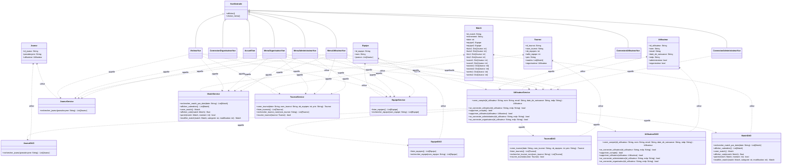

# Diagramme de classes des objets métiers

Ce diagramme est codé avec [mermaid](https://mermaid.js.org/syntax/classDiagram.html) :

```mermaid
classDiagram
    VueAbstraite <|-- VisiteurVue
    VueAbstraite <|-- MenuOrganisateurVue
    VueAbstraite <|-- ConnexionOrganisateurVue
    VueAbstraite <|-- AccueilVue
    VueAbstraite <|-- MenuUtilisateurVue
    VueAbstraite <|-- ConnexionUtilisateurVue
    VueAbstraite <|-- MenuAdministrateurVue
    VueAbstraite <|-- ConnexionAdministrateurVue
    VueAbstraite : +afficher()
    VueAbstraite : +choisir_menu()

    MenuUtilisateurVue ..> UtilisateurService : appelle
    ConnexionUtilisateurVue ..> UtilisateurService : appelle
    Utilisateur <.. UtilisateurService : utilise
    Joueur <.. JoueurService : utilise
    Match <.. MatchService : utilise
    UtilisateurService ..> UtilisateurDAO : appelle
    UtilisateurService ..> MatchDAO : appelle
    Match <.. MatchDAO : utilise
    UtilisateurService ..> JoueurDAO : appelle
    Joueur <.. JoueurDAO : utilise
    Utilisateur <.. UtilisateurDAO : utilise
    Tournoi <.. TournoiService : utilise
    Equipe <.. EquipeService : utilise
    UtilisateurService ..> TournoiDAO : appelle
    UtilisateurService ..> EquipeDAO : appelle
    Equipe <.. EquipeDAO : utilise
    Tournoi <.. TournoiDAO : utilise

    VisiteurVue ..> UtilisateurService : appelle
    MenuOrganisateurVue ..> UtilisateurService : appelle
    MenuUtilisateurVue ..> UtilisateurService : appelle
    ConnexionAdministrateurVue ..> UtilisateurService : appelle
    MenuAdministrateurVue ..> UtilisateurService : appelle
    
    VisiteurVue ..> JoueurService : appelle
    MenuOrganisateurVue ..> JoueurService : appelle
    MenuUtilisateurVue ..> JoueurService : appelle
    MenuAdministrateurVue ..> JoueurService : appelle
    
    VisiteurVue ..> MatchService : appelle
    MenuOrganisateurVue ..> MatchService : appelle
    MenuUtilisateurVue ..> MatchService : appelle
    MenuAdministrateurVue ..> MatchService : appelle
    
    VisiteurVue ..> TournoiService : appelle
    MenuOrganisateurVue ..> TournoiService : appelle
    MenuUtilisateurVue ..> TournoiService : appelle
    MenuAdministrateurVue ..> TournoiService : appelle
 
    VisiteurVue ..> EquipeService : appelle
    MenuOrganisateurVue ..> EquipeService : appelle
    MenuUtilisateurVue ..> EquipeService : appelle
    MenuAdministrateurVue ..> EquipeService : appelle


    class Tournoi{
        +id_tournoi: String
        +nom_tournoi: String
        +nb_equipes: int
        +taille_equipe: int
        +prix: String
        +matchs: List[Match]
        +organisateur: Utilisateur
    }

    class Joueur{
        +id_joueur: String
        +pseudonyme: String
        +utilisateur: Utilisateur
    }

    class Match{
        +id_match: String
        +evenement: String
        +date: str
        +equipe1: Equipe
        +equipe2: Equipe
        +buts1: Dict[Joueur: int]
        +buts2: Dict[Joueur: int]
        +tirs1: Dict[Joueur: int]
        +tirs2: Dict[Joueur: int]
        +score1: Dict[Joueur: int]
        +score2: Dict[Joueur: int]
        +assists1: Dict[Joueur: int]
        +assists2: Dict[Joueur: int]
        +arrets1: Dict[Joueur: int]
        +arrets2: Dict[Joueur: int]
    }

    class Utilisateur{
        +id_utilisateur: String
        +nom: String
        +email: String
        +date_de_naissance: String
        +mdp: String
        +administrateur: bool
        +organisateur: bool
    }

    class Equipe{
        +id_equipe: String
        +nom: String
        +joueurs: List[Joueur]
    }

    class UtilisateurService{
        +creer_compte(id_utilisateur: String, nom: String, email: String, date_de_naissance: String, mdp: String) Utilisateur
        +se_connecter_utilisateur(id_utilisateur: String, mdp: String) bool
        +supprimer_compte() bool
        +supprimer_utilisateur(utilisateur: Utilisateur) bool
        +se_connecter_administrateur(id_utilisateur: String, mdp: String) bool
        +se_connecter_organisateur(id_utilisateur: String, mdp: String) bool
    }

    class UtilisateurDAO{
        +creer_compte(id_utilisateur: String, nom: String, email: String, date_de_naissance: String, mdp: String) Utilisateur
        +se_connecter_utilisateur(id_utilisateur: String, mdp: String) bool
        +supprimer_compte() bool
        +supprimer_utilisateur(utilisateur: Utilisateur) bool
        +se_connecter_administrateur(id_utilisateur: String, mdp: String) bool
        +se_connecter_organisateur(id_utilisateur: String, mdp: String) bool
    }

    class MatchDAO{
        +rechercher_match_par_date(date: String) List[Match]
        +afficher_calendrier() List[Match]
        +creer_match() Match
        +afficher_cote(match: Match) float
        +parier(match: Match, montant: int) bool
        +modifier_match(match: Match, categorie: str, modification: int) Match
    }

    class JoueurDAO{
        +rechercher_joueur(pseudonyme: String) List[Joueur]
    }

    class EquipeDAO{
        +lister_equipes() List[Equipe]
        +rechercher_equipe(nom_equipe: String) List[Equipe]
    }

    class TournoiDAO{
        +creer_tournoi(date: String, nom_tournoi: String, nb_equipes: int, prix: String) Tournoi
        +lister_tournois() List[Tournoi]
        +rechercher_tournoi_nom(nom_tournoi: String) List[Tournoi]
        +inscrire_tournoi(tournoi: Tournoi) bool
    }

    class MatchService{
        +rechercher_match_par_date(date: String) List[Match]
        +afficher_calendrier() List[Match]
        +creer_match() Match
        +afficher_cote(match: Match) float
        +parier(match: Match, montant: int) bool
        +modifier_match(match: Match, categorie: str, modification: int) Match
    }

    class JoueurService{
        +rechercher_joueur(pseudonyme: String) List[Joueur]
    
    }

    class TournoiService{
        +creer_tournoi(date: String, nom_tournoi: String, nb_equipes: int, prix: String) Tournoi
        +lister_tournois() List[Tournoi]
        +rechercher_tournoi_nom(nom_tournoi: String) List[Tournoi]
        +inscrire_tournoi(tournoi: Tournoi) bool
    }

    class EquipeService{
        +lister_equipes() List[Equipe]
        +rechercher_equipe(nom_equipe: String) List[Equipe]
    }
```
