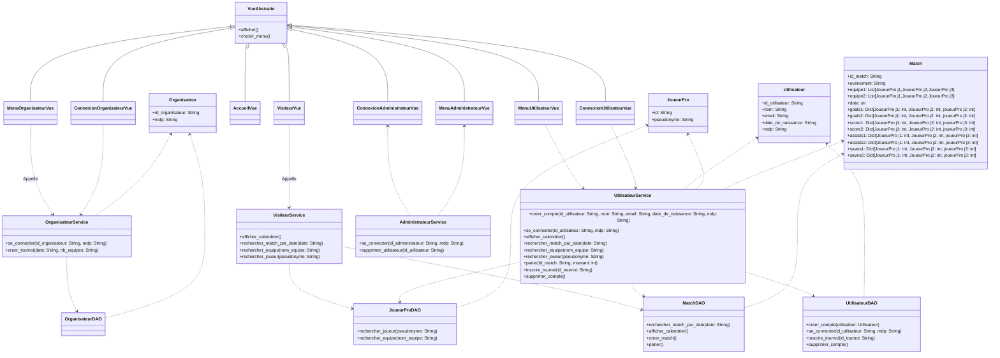

```mermaid

classDiagram
    VueAbstraite <|-- VisiteurVue
    VueAbstraite <|-- MenuOrganisateurVue
    VueAbstraite <|-- ConnexionOrganisateurVue
    VueAbstraite <|-- AccueilVue
    VueAbstraite <|-- MenuUtilisateurVue
    VueAbstraite <|-- ConnexionUtilisateurVue
    VueAbstraite <|-- MenuAdministrateurVue
    VueAbstraite <|-- ConnexionAdministrateurVue
    VueAbstraite : +afficher()
    VueAbstraite : +choisir_menu()

    VisiteurVue ..> VisiteurService : Appelle
    MenuOrganisateurVue ..> OrganisateurService : Appelle
    ConnexionOrganisateurVue ..> OrganisateurService
    Organisateur <.. OrganisateurService
    MenuUtilisateurVue ..> UtilisateurService
    ConnexionUtilisateurVue ..> UtilisateurService
    Utilisateur <.. UtilisateurService
    JoueurPro <.. UtilisateurService
    ConnexionAdministrateurVue <.. AdministrateurService
    MenuAdministrateurVue <.. AdministrateurService
    Match <.. UtilisateurService
    VisiteurService ..> MatchDAO
    VisiteurService ..> JoueurProDAO
    OrganisateurService ..> OrganisateurDAO
    UtilisateurService ..> UtilisateurDAO
    UtilisateurService ..> MatchDAO
    Match <.. MatchDAO
    UtilisateurService ..> JoueurProDAO
    JoueurPro <.. JoueurProDAO
    Utilisateur <.. UtilisateurDAO
    Organisateur <.. OrganisateurDAO
    class JoueurPro{
        +id: String
        +pseudonyme: String
    }

    class Match{
        +id_match: String
        +evenement: String
        +equipe1: List[JoueurPro j1,JoueurPro j2,JoueurPro j3]
        +equipe2: List[JoueurPro j1,JoueurPro j2,JoueurPro j3]
        +date: str
        +goals1: Dict[JoueurPro j1: int, JoueurPro j2: int, joueurPro j3: int]
        +goals2: Dict[JoueurPro j1: int, JoueurPro j2: int, joueurPro j3: int]
        +score1: Dict[JoueurPro j1: int, JoueurPro j2: int, joueurPro j3: int]
        +score2: Dict[JoueurPro j1: int, JoueurPro j2: int, joueurPro j3: int]
        +assists1: Dict[JoueurPro j1: int, JoueurPro j2: int, joueurPro j3: int]
        +assists2: Dict[JoueurPro j1: int, JoueurPro j2: int, joueurPro j3: int]
        +saves1: Dict[JoueurPro j1: int, JoueurPro j2: int, joueurPro j3: int]
        +saves2: Dict[JoueurPro j1: int, JoueurPro j2: int, joueurPro j3: int]
    }

    class Utilisateur{
        +id_utilisateur: String
        +nom: String
        +email: String
        +date_de_naissance: String
        +mdp: String
    }

    class VisiteurService{
        +afficher_calendrier()
        +rechercher_match_par_date(date: String)
        +rechercher_equipe(nom_equipe: String)
        +rechercher_joueur(pseudonyme: String)
    }

    class OrganisateurService{
        +se_connecter(id_organisateur: String, mdp: String)
        +creer_tournoi(date: String, nb_equipes: String)
    }

    class UtilisateurService{
        +creer_compte(id_utilisateur: String, nom: String, email: String, date_de_naissance: String, mdp: String)
        +se_connecter(id_utilisateur: String, mdp: String)
        +afficher_calendrier()
        +rechercher_match_par_date(date: String)
        +rechercher_equipe(nom_equipe: String)
        +rechercher_joueur(pseudonyme: String)
        +parier(id_match: String, montant: int)
        +inscrire_tournoi(id_tournoi: String)
        +supprimer_compte()
    }
    class UtilisateurDAO{
        +creer_compte(utilisateur: Utilisateur)
        +se_connecter(id_utilisateur: String, mdp: String)
        +inscrire_tournoi(id_tournoi: String)
        +supprimer_compte()
    }

    class Organisateur{
        +id_organisateur: String
        +mdp: String
    }

    class AdministrateurService{
        +se_connecter(id_administrateur: String, mdp: String)
        +supprimer_utilisateur(id_utilisateur: String)

    }

    class MatchDAO{
        +rechercher_match_par_date(date: String)
        +afficher_calendrier()
        +creer_match()
        +parier()
    }

    class JoueurProDAO{
        +rechercher_joueur(pseudonyme: String)
        +rechercher_equipe(nom_equipe: String)
    }
```
