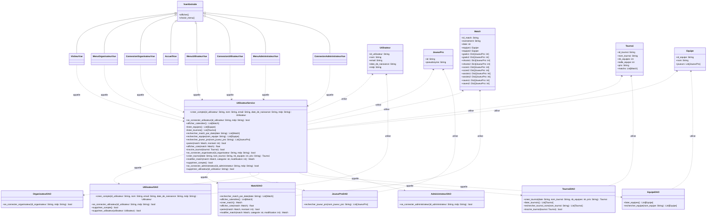

```mermaid

classDiagram
    VueAbstraite <|-- VisiteurVue
    VueAbstraite <|-- MenuOrganisateurVue
    VueAbstraite <|-- ConnexionOrganisateurVue
    VueAbstraite <|-- AccueilVue
    VueAbstraite <|-- MenuUtilisateurVue
    VueAbstraite <|-- ConnexionUtilisateurVue
    VueAbstraite <|-- MenuAdministrateurVue
    VueAbstraite <|-- ConnexionAdministrateurVue
    VueAbstraite : +afficher()
    VueAbstraite : +choisir_menu()

    MenuUtilisateurVue ..> UtilisateurService : appelle
    ConnexionUtilisateurVue ..> UtilisateurService : appelle
    Utilisateur <.. UtilisateurService : utilise
    JoueurPro <.. UtilisateurService : utilise
    Match <.. UtilisateurService : utilise
    UtilisateurService ..> UtilisateurDAO : appelle
    UtilisateurService ..> MatchDAO : appelle
    Match <.. MatchDAO : utilise
    UtilisateurService ..> JoueurProDAO : appelle
    JoueurPro <.. JoueurProDAO : utilise
    Utilisateur <.. UtilisateurDAO : utilise
    UtilisateurService ..> OrganisateurDAO : appelle
    Tournoi <.. UtilisateurService : utilise
    Equipe <.. UtilisateurService : utilise
    UtilisateurService ..> TournoiDAO : appelle
    UtilisateurService ..> EquipeDAO : appelle
    UtilisateurService ..> AdministrateurDAO : appelle
    Equipe <.. EquipeDAO : utilise
    Tournoi <.. TournoiDAO : utilise
    VisiteurVue ..> UtilisateurService : appelle
    MenuOrganisateurVue ..> UtilisateurService : appelle
    ConnexionOrganisateurVue ..> UtilisateurService : appelle
    ConnexionAdministrateurVue ..> UtilisateurService : appelle
    MenuAdministrateurVue ..> UtilisateurService : appelle
    class Tournoi{
        +id_tournoi: String
        +nom_tournoi: String
        +nb_equipes: int
        +taille_equipe: int
        +prix: String
        +matchs: List[Match]
    }

    class JoueurPro{
        +id: String
        +pseudonyme: String
    }

    class Match{
        +id_match: String
        +evenement: String
        +date: str
        +equipe1: Equipe
        +equipe2: Equipe
        +goals1: Dict[JoueurPro: int]
        +goals2: Dict[JoueurPro: int]
        +shoots1: Dict[JoueurPro: int]
        +shoots2: Dict[JoueurPro: int]
        +score1: Dict[JoueurPro: int]
        +score2: Dict[JoueurPro: int]
        +assists1: Dict[JoueurPro: int]
        +assists2: Dict[JoueurPro: int]
        +saves1: Dict[JoueurPro: int]
        +saves2: Dict[JoueurPro: int]
    }

    class Utilisateur{
        +id_utilisateur: String
        +nom: String
        +email: String
        +date_de_naissance: String
        +mdp: String
    }

    class Equipe{
        +id_equipe: String
        +nom: String
        +joueurs: List[JoueurPro]
    }

    class UtilisateurService{
        +creer_compte(id_utilisateur: String, nom: String, email: String, date_de_naissance: String, mdp: String) Utilisateur
        +se_connecter_utilisateur(id_utilisateur: String, mdp: String) bool
        +afficher_calendrier() List[Match]
        +lister_equipes() List[Equipe]
        +lister_tournois() List[Tournoi]
        +rechercher_match_par_date(date: String) List[Match]
        +rechercher_equipe(nom_equipe: String) List[Equipe]
        +rechercher_joueur_pro(nom_joueur_pro: String) List[JoueurPro]
        +parier(match: Match, montant: int) bool
        +afficher_cote(match: Match) float
        +inscrire_tournoi(tournoi: Tournoi) bool
        +se_connecter_organisateur(id_organisateur: String, mdp: String) bool
        +creer_tournoi(date: String, nom_tournoi: String, nb_equipes: int, prix: String) Tournoi
        +modifier_match(match: Match, categorie: str, modification: int) Match
        +supprimer_compte() bool
        +se_connecter_administrateur(id_administrateur: String, mdp: String) bool
        +supprimer_utilisateur(id_utilisateur: String) bool
    }

    class UtilisateurDAO{
        +creer_compte(id_utilisateur: String, nom: String, email: String, date_de_naissance: String, mdp: String) Utilisateur
        +se_connecter_utilisateur(id_utilisateur: String, mdp: String) bool
        +supprimer_compte() bool
        +supprimer_utilisateur(utilisateur: Utilisateur) bool
    }

    class MatchDAO{
        +rechercher_match_par_date(date: String) List[Match]
        +afficher_calendrier() List[Match]
        +creer_match() Match
        +afficher_cote(match: Match) float
        +parier(match: Match, montant: int) bool
        +modifier_match(match: Match, categorie: str, modification: int) Match
    }

    class JoueurProDAO{
        +rechercher_joueur_pro(nom_joueur_pro: String) List[JoueurPro]
    }

    class OrganisateurDAO{
        +se_connecter_organisateur(id_organisateur: String, mdp: String) bool
    }

    class AdministrateurDAO{
        +se_connecter_administrateur(id_administrateur: String, mdp: String) bool
    }

    class EquipeDAO{
        +lister_equipes() List[Equipe]
        +rechercher_equipe(nom_equipe: String) List[Equipe]
    }

    class TournoiDAO{
        +creer_tournoi(date: String, nom_tournoi: String, nb_equipes: int, prix: String) Tournoi
        +lister_tournois() List[Tournoi]
        +rechercher_tournoi_nom(nom_tournoi: String) List[Tournoi]
        +inscrire_tournoi(tournoi: Tournoi) bool
    }
```
